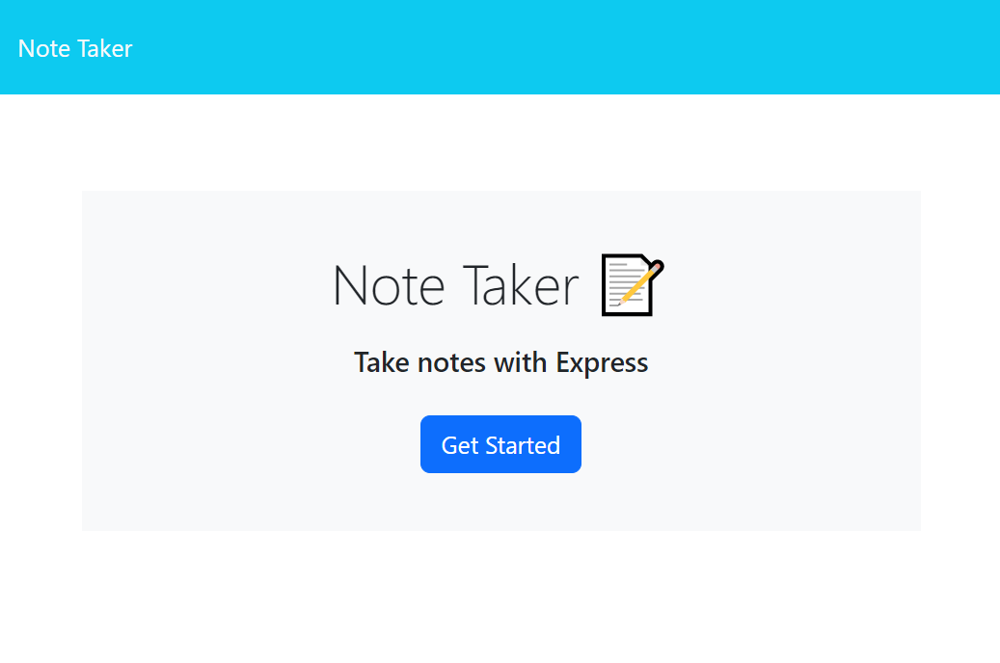
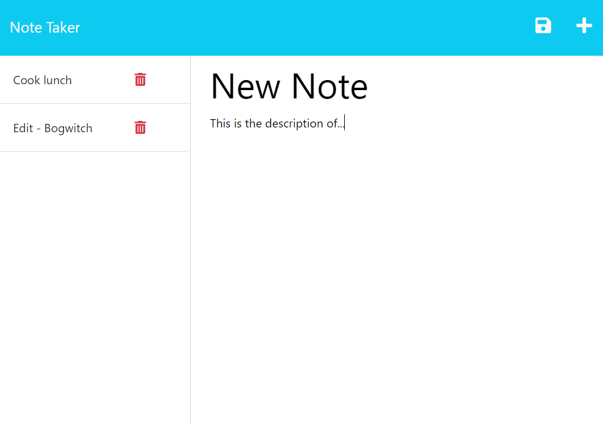
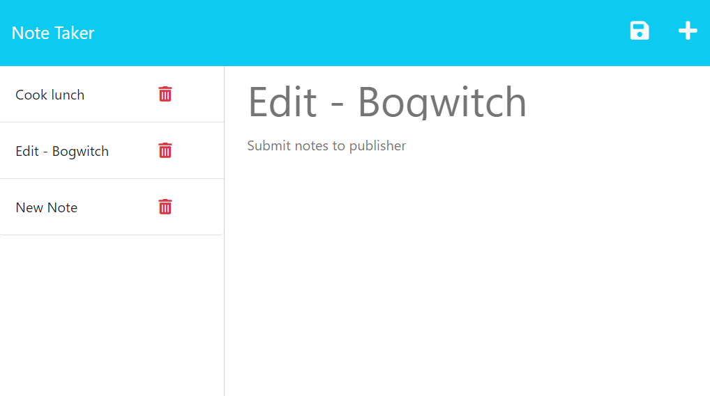

# NoteTaker

## Description

Note Taker is a simple application to write and save notes. It's a handy tool for organizing your thoughts and keeping track of your tasks that need completing.

## Table of Contents

- [Usage](#usage)
- [License](#license)
- [Contributing](#contributing)
- [Questions](#questions)
- [Credits](#credits)
- [Links](#links)

## Usage

When you open the app you are presented with the landing page. Press **Get Started** button to proceed to the notes editor.

There you are presented with the list of existing notes on the left and empty fields to enter a new note title and the note’s text in the right-hand column. Once you enter a new note title and the note’s text a Save icon 💾 appears in the navigation at the top of the page. Once you click it your new note is saved and appears at the bottom of the list on the left.

The existing notes can be clicked to be presented in the right-hand column. If you click `➕, the Write icon in the navigation at the top of the page, you are presented with empty fields to enter a new note title and the note’s text in the right-hand column.

Each existing note has a Delete Icon 🗑️ next to it. You can delete the notes by clicking on the icon.

(<a href="#readme-top">back to top</a>)

## License

Distributed under the [MIT License](https://opensource.org/licenses/MIT). See LICENSE.txt for more information.

(<a href="#readme-top">back to top</a>)

## Contributing

If you have a suggestion that would make this better, please fork the repo and create a pull request. You can also simply open an issue with the tag "enhancement".
Don't forget to give the project a star!

1. Fork the Project
2. Create your Feature Branch (`git checkout -b feature/YourFeature`)
3. Commit your Changes (`git commit -m 'Add Your Feature'`)
4. Push to the Branch (`git push origin feature/YourFeature`)
5. Open a Pull Request

(<a href="#readme-top">back to top</a>)

## Questions

If you have any questions about the project please contact me through [my Github](https://github.com/voi-jankowski) or email me at [voi.jankowski@gmail.com](mailto:voi.jankowski@gmail.com).

(<a href="#readme-top">back to top</a>)

## Credits

The project was created with the help of:

- The template for 404 error created by Marco Peretto and sourced from [DEV](https://dev.to/stackfindover/35-html-404-page-templates-5bge)
- The friont-end created by edX Boot Camps LLC.

(<a href="#readme-top">back to top</a>)

## LInks

The location of the project [on GitHub](https://github.com/voi-jankowski/note-taker).

You can check out the live application [here](https://note-taker-27-04-2023.herokuapp.com/).

(<a href="#readme-top">back to top</a>)

